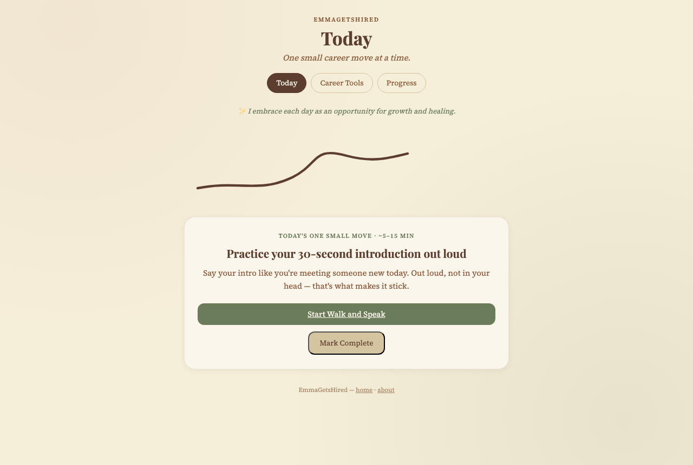
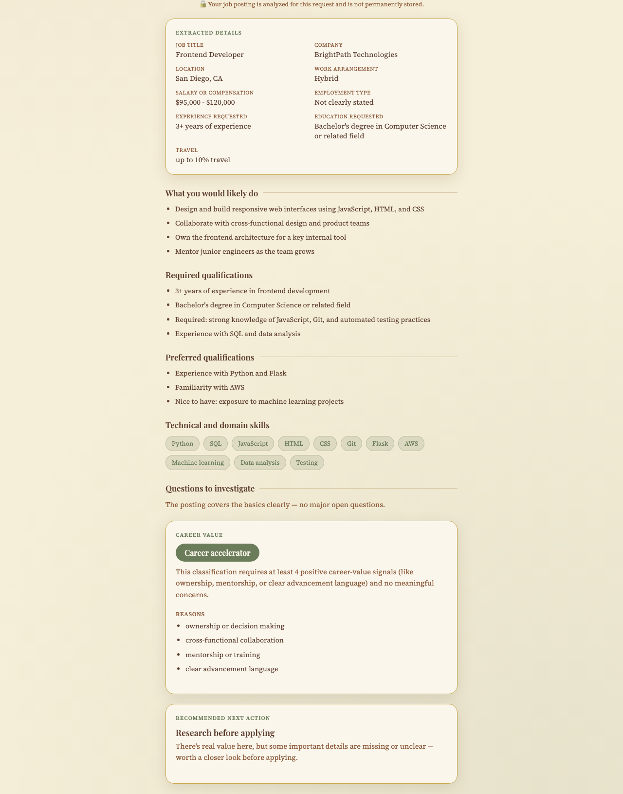

# EmmaGetsHired

EmmaGetsHired is an ADHD friendly career action copilot that turns job searching into one manageable next step at a time. It combines guided career actions, communication practice, opportunity analysis, automatic progress tracking, and privacy conscious design in a single Flask application.

## Product Preview

<p align="center">
  
</p>

<p align="center"><em>One manageable career action at a time.</em></p>

### Career Opportunity Decoder

<p align="center">
  
</p>

<p align="center"><em>A fictional job posting organized into clear facts, career value, and one practical next step.</em></p>

## Overview

Job searching creates a lot of open-ended decisions at once: what to work on today, how to talk about a career change, whether a posting is worth pursuing. That overload is often where momentum stalls. EmmaGetsHired surfaces one clear, time-boxed action at a time instead of a long task list, and logs progress automatically. It's built for anyone navigating a job search or career transition who benefits from structure without pressure.

## Core Features

**Today** — One rotating career action (practice an introduction, send a LinkedIn message, decode a posting). It stays consistent all day, changes the next, and marking it complete never logs a duplicate on refresh.

**Career Opportunity Decoder** — Paste one job posting and get key job details, likely responsibilities, required and preferred qualifications, technical/domain skills found in the text, questions worth investigating, a career value classification, and one next action. Deterministic Python text processing only — no resume comparison, no hiring prediction, no permanent storage of the posting, no external AI API.

**Walk and Speak** — Speaking prompts for introductions, networking, interviews, explaining a career transition, and recovering confidently mid-sentence.

**LinkedIn Message Creator** — Template-based networking messages for meeting someone at an event, asking for advice, or following up — no external AI API.

**Career Event Finder** — Outbound search links (Google, LinkedIn Events, Meetup, Eventbrite) built from a saved location and career interests.

**Progress** — Automatically summarizes completed actions, this week's activity, the most consistent action type, and a weekly growth stage, from existing logs.

**Signature Growth Trail** — A reusable inline SVG animation shared across Today, Career Tools, and Progress, respecting `prefers-reduced-motion` by rendering the completed illustration immediately.

## Career Opportunity Decoder Logic

Every decoded posting is classified as **Career accelerator**, **Strategic stepping stone**, **Lateral opportunity**, or **Low return opportunity**. This evaluates the opportunity's potential career value — not the user's likelihood of being hired. The rules are transparent and documented in code: they weigh positive signals (ownership, mentorship, advancement language, relevant technical exposure), concerns (unpaid or commission-only work, vague responsibilities, heavy travel), and information the posting doesn't clearly state. No numerical score is calculated or shown.

## Technical Stack

- **Python** — application and analysis logic, as small, testable functions.
- **Flask** — routing, request handling, and template rendering.
- **SQLite** — per-user settings, action logs, and tool preferences, via hand-written SQL, no ORM.
- **Jinja** — shared navigation and growth trail includes across templates.
- **HTML and CSS** — one hand-written stylesheet driving a calm, cream/brown/sage/gold system.
- **SVG** — the growth trail animation is inline, hand-authored markup, not an image or charting library.
- **Gunicorn** — the WSGI server referenced in the Procfile for running outside Flask's dev server.
- **pytest** — the automated test suite.
- **Git and GitHub** — version control and the hosted repository.

## Architecture and Engineering Decisions

- Opportunity analysis lives in its own module (`opportunity_decoder.py`), separate from `app.py`, so it's unit testable without a server.
- Every visitor gets a private space via an anonymous cookie identifier — no login, no shared data.
- Tables use `CREATE TABLE IF NOT EXISTS`, so new features never risk existing data.
- The daily action is chosen deterministically from the calendar date, so it's stable within a day.
- Completed actions are checked before re-logging, preventing duplicates from a refresh.
- Templates share a navigation partial and a growth trail partial instead of duplicating markup.
- The layout is responsive on small mobile widths; animations respect reduced-motion preferences.
- Gunicorn support allows production-style WSGI startup, with no claim of production scale or full authentication.

## Privacy and Responsible Design

Job posting text is analyzed only for the current request and never written to the database, disk, or logs. To prevent a refresh from logging a duplicate action, the app stores a short one-way fingerprint of the posting instead — the original text can't be recovered from it. No posting content is sent to an external AI service, because none is used. The decoder never claims a user is qualified, and when a posting doesn't clearly state something, the interface says so directly instead of guessing.

## SQL Portfolio Evidence

`career_insights.sql` is a standalone portfolio artifact written against the real application schema — not imported or executed by the Flask app. It demonstrates `SELECT`, `WHERE`, `GROUP BY`, `ORDER BY`, aggregate functions, `CASE`, a common table expression, and a window function, across six analyses: actions this week, actions by type, weekly totals, the most frequent action type, the most active day, and a seven-day trend.

## Testing

The project currently has 176 passing tests, covering opportunity extraction, career value classification and next-action rules, privacy behavior, duplicate-log prevention, Flask routes, database operations, per-user isolation, every SQL portfolio query, progress calculations, and the app's other existing features. This reflects current coverage, not a claim of completeness or perfect accuracy.

## Local Setup

```bash
git clone https://github.com/EmmaWichmann/emmagetshired.git
cd emmagetshired
```

macOS / Linux:

```bash
python3 -m venv venv
source venv/bin/activate
pip install -r requirements.txt
python app.py
```

Windows:

```bash
python -m venv venv
venv\Scripts\activate
pip install -r requirements.txt
python app.py
```

Open `http://127.0.0.1:5000` in a browser. If port 5000 is already in use, run with an alternate port (for example `flask --app app run --port 5050`) and open that port instead.

Run the test suite with:

```bash
pytest -q
```

## Project Structure

```
emmagetshired/
├── app.py
├── database.py
├── opportunity_decoder.py
├── career_insights.sql
├── requirements.txt
├── templates/
├── static/
├── test_app.py
├── test_database.py
├── test_opportunity_decoder.py
└── test_career_insights.py
```

## What This Project Demonstrates

Product thinking about reducing decision overload, Python application development, regex-based text processing, Flask routing, SQLite and hand-written SQL, an automated test suite, privacy-conscious design, accessibility, responsive design, and iterative debugging as real edge cases surfaced. Parts of this project were built with AI assisted development — every generated change was reviewed, tested, and refined by hand rather than accepted without inspection.

## Current Limitations

The Career Opportunity Decoder relies on regex and a maintained keyword whitelist, not natural language understanding, so it performs best on structured, English-language postings and shows "Not clearly stated" more on unusual formats. It does not pull job data externally, evaluate employer reputation, or predict hiring outcomes. Persistence is local SQLite, and identity is anonymous and cookie-based rather than full account authentication.
